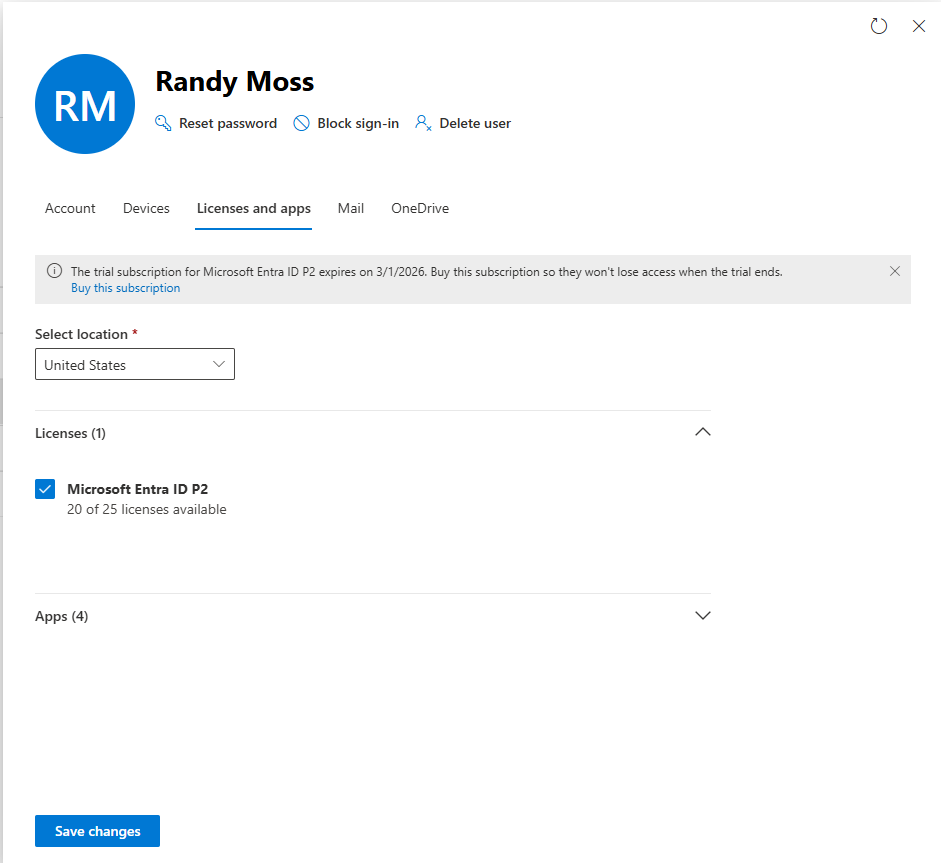
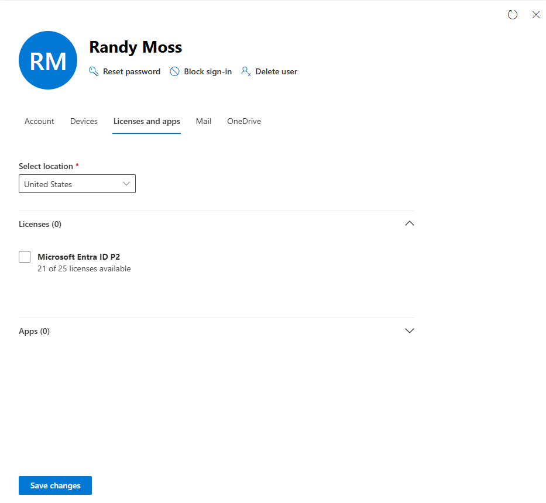
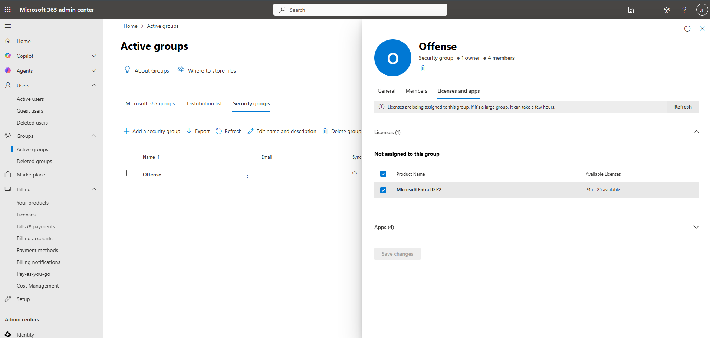
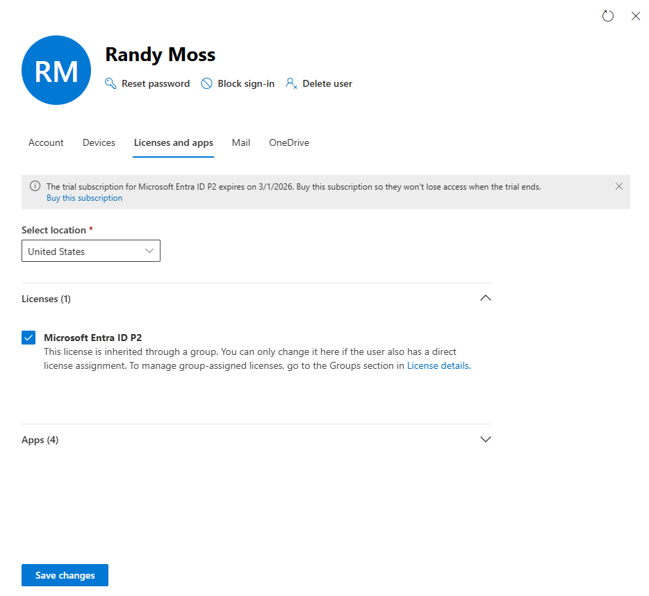
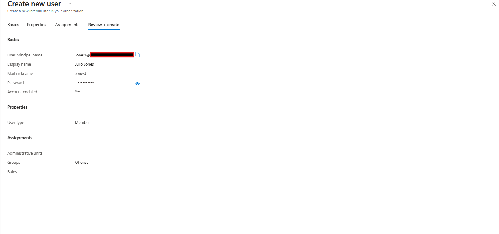
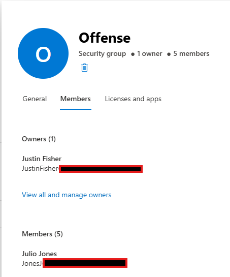
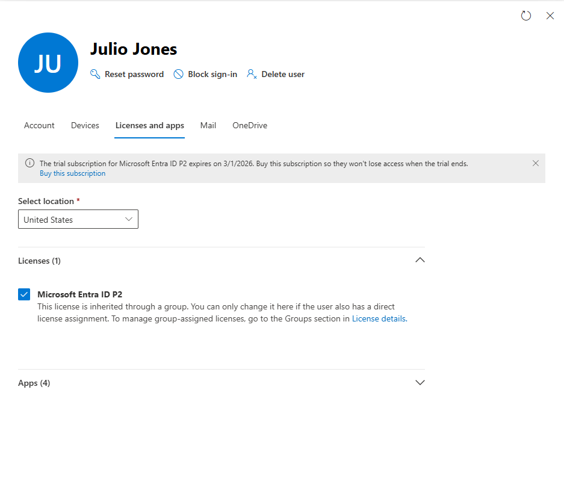

#  Group-Based Licensing in Microsoft Entra ID

##  Overview

This lab demonstrates how to implement **group-based licensing** in Microsoft Entra ID to improve scalability, automation, and adherence to IAM best practices.

Instead of assigning licenses individually, licenses are assigned to a group, and users inherit licenses automatically through membership.

---

##  Objectives

* Remove direct license assignments from users
* Assign Microsoft Entra ID P2 license to a security group
* Validate license inheritance
* Automate licensing for new users via group membership

---

##  Environment

* Microsoft Entra ID (Azure AD)
* Microsoft 365 Admin Center
* License: Microsoft Entra ID P2 (Trial)

---

##  Initial State (Direct Licensing - NOT Best Practice)

Users were initially assigned licenses individually.

---

##  Step 1: Remove Direct License Assignment

Removed the Microsoft Entra ID P2 license from the user.

This prepares the environment for group-based licensing.

---

##  Step 2: Assign License to Group

Assigned Microsoft Entra ID P2 license to the **Offense** security group.

 All members of this group will now inherit the license.

---

##  Step 3: Validate License Inheritance

User now shows:

* License is **inherited from group**
* Cannot be modified directly at user level

 Confirms group-based licensing is working.

---

##  Step 4: Create New User and Assign to Group

Created a new user and assigned them to the **Offense** group during creation.

---

##  Step 5: Verify Group Membership

Confirmed the new user is part of the Offense group.

---

##  Step 6: Validate Automatic License Assignment

New user automatically receives the Microsoft Entra ID P2 license via group membership.

---

##  Key Takeaways

* Group-based licensing reduces administrative overhead
* Ensures consistency across users
* Prevents human error from manual assignments
* Scales efficiently in enterprise environments

---

##  Real-World Use Case

In enterprise environments, departments (e.g., HR, Finance, IT) are assigned licenses via groups. When a user joins or leaves a department, licensing is automatically handled via group membership.

---

##  Conclusion

This lab demonstrates how to transition from manual licensing to an automated, scalable IAM approach using Microsoft Entra ID group-based licensing.

---
